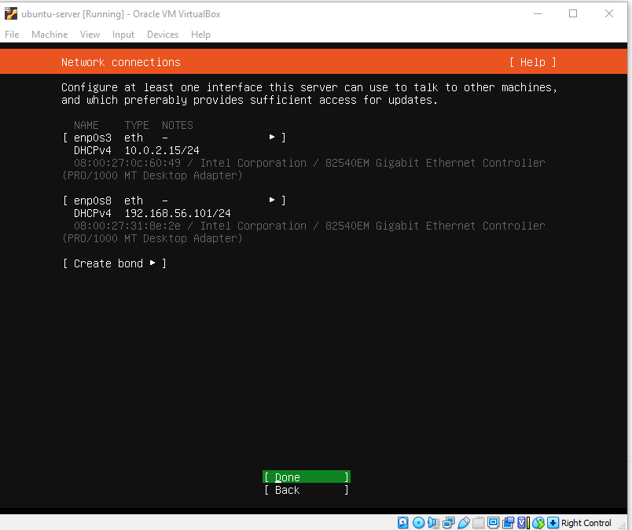

# Stage 3 Installation Guide

Document follows [this guide](https://www.free5gc.org/installations/stage-3-vm-basics/) with every step listed below included.

- [Creating a Ubuntu VM using VirtualBox](https://www.free5gc.org/installations/stage-3-vm-basics/)
- [Creating and Configuring a free5GC VM](https://www.free5gc.org/installations/stage-3-free5gc-vm/)
- [Installing and Testing free5GC Core Network](https://www.free5gc.org/installations/stage-3-free5gc-install/)
- [Installing a UE/RAN Simulator](https://www.free5gc.org/installations/stage-3-sim-install/)
- [free5GC Simple Apps](https://www.free5gc.org/installations/stage-3-free5gc-app/)
- [free5GC Demo Videos](https://www.free5gc.org/stage-3-videos/video-index/)
- [Environment setup of multiple SMF, DNN, and UPF (including ULCL)](https://www.youtube.com/watch?v=AEMrjKRWarw)

## 1 Install Virtual Box

## 2 Download Ubuntu Server

Use this link


## 3 Create a Ubuntu Server VM

> We use Ubuntu Server instead of Ubuntu Desktop because we only need a basic server machine without too many unnecessary functionalities. The resulting overhead to your host machine is smaller, and the VM starts up faster too.

### 3.1 New VM

Launch VirtualBox and click `new`.


- Name the first VM using a generic name as `ubuntu`, `ubuntu-server`, or `ubuntu-20.04`
- You can pick 1 or 2 (or more) CPUs, and about 2048M memory, although you can change them later


- Create a virtual hard disk VDI with about 10GB memory size.


### 3.2 Setup VM

- You can increase the CPU number from default 1 to 2.


- Also we need to plug in our "CD" with ubuntu (the .iso file)
- To do so move to "Storage" and clikc "+" under Controller: IDE option as shown below


- And add your .iso file and the choose it


- Move to the "Network" and enable second adapter. Make it Host-only, rest of config leave default.


### 3.3 Start the VM

Installation is a long process I will list only the key-points. Unsaid things leave default and things like language, keyboard etc. are left for you.

- Choose "Ubuntu Server" option from GRUB menu
- Choose "Ubntu Server" as the base for installation not "Ubuntu server (minimized)"
- Leave Network Connections default
  - 

- Uncheck "the LVM option"
  - not choosing LVM will make it a little bit easier later if you want to extend your disk space


- it is recommended that you choose short username and password for ease of typing later


- Install SSH server


- Later follow the displayed instructions.

### 3.4 Test your ubuntu-server installation

After you've logged in type in some commands:

- `ping google.com`
- `ifconfig`
  - It may require installation of `net-tools`


Of course addresses on your machine may differ.

Your display may look different, but take notes about the IP address of the *Host-only* interface card. The example above shows `192.168.56.101`. You can SSH from your host machine into this Ubuntu VM using the IP later. (Another IP address, `10.0.2.15` is the IP address of the NAT interface card, the apps in your host machine cannot access it).

## 4 Connect to the Ubuntu-server VM via SSH

### 4.1 Launch MobaXterm

On your host system (in my case - Windows) launch MobaXterm, which is my favourite SSH client. You can download it from [here](https://mobaxterm.mobatek.net).

- Open new terminal tab


- Paste this command into the terminal

```bash
  ssh <host_only_network_IP_adrress_of_ubuntu_server> -l <username_on_ubuntu_server>
```

- In my case it is:

```bash
ssh 192.168.56.101 -l ejek
```

### 4.2 Test SSH connection

Check if you can perfom following actions:

- `ping google.com`
- `ifconfig`


From now on the communication with ubuntu-server can be done by SSH connection. 

## 5 Update and Upgrade your Ubuntu

Let also update and upgrade the Ubuntu VM right now to make sure it is up-to-date with proper security updates.

```bash
sudo apt update
sudo apt upgrade
```

## 6 How to exit the configuration

- In SSH Client you can type `exit`to close the connection.


- You can close the SSH Client now.

- On the Ubuntu-server VM just click the "X" to close the window. When the dialog pops-up select "Send the shutdown signal"


You can close the Virtual Box window.

## 7 How to run it the next time

1. Launch Oracle VM VirtualBox Manager
2. Select "ubuntu-server" VM and start it.
3. Launch SSH Client (e.g. MobaXterm)
4. Type in   `ssh <host_only_network_IP_adrress_of_ubuntu_server> -l <username_on_ubuntu_server>`
   1. e.g `ssh 192.168.56.101 -l ejek`


