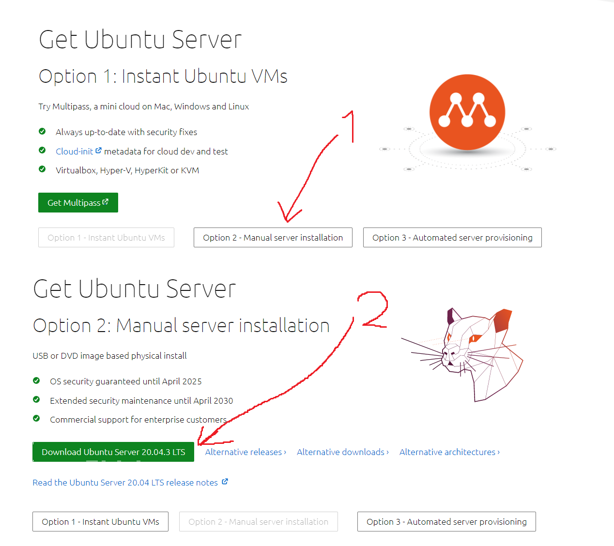

Document follows [this guide](https://www.free5gc.org/installations/stage-3-vm-basics/) with every step listed below included.

- [Creating a Ubuntu VM using VirtualBox](https://www.free5gc.org/installations/stage-3-vm-basics/)
- [Creating and Configuring a free5GC VM](https://www.free5gc.org/installations/stage-3-free5gc-vm/)
- [Installing and Testing free5GC Core Network](https://www.free5gc.org/installations/stage-3-free5gc-install/)
- [Installing a UE/RAN Simulator](https://www.free5gc.org/installations/stage-3-sim-install/)
- [free5GC Simple Apps](https://www.free5gc.org/installations/stage-3-free5gc-app/)
- [free5GC Demo Videos](https://www.free5gc.org/stage-3-videos/video-index/)
- [Environment setup of multiple SMF, DNN, and UPF (including ULCL)](https://www.youtube.com/watch?v=AEMrjKRWarw)

# Step 1 - Create Ubuntu Server VM

## 1 Install Virtual Box

## 2 Download Ubuntu Server

Use this https://ubuntu.com/download/server



## 3 Create a Ubuntu Server VM

> We use Ubuntu Server instead of Ubuntu Desktop because we only need a basic server machine without too many unnecessary functionalities. The resulting overhead to your host machine is smaller, and the VM starts up faster too.

### 3.1 New VM

Launch VirtualBox and click `new`.


- Name the first VM using a generic name as `ubuntu`, `ubuntu-server`, or `ubuntu-20.04`
- You can pick 1 or 2 (or more) CPUs, and about 2048M memory, although you can change them later


- Create a virtual hard disk VDI with about 10GB memory size.


### 3.2 Setup VM

- You can increase the CPU number from default 1 to 2.


- Also we need to plug in our "CD" with ubuntu (the .iso file)
- To do so move to "Storage" and clikc "+" under Controller: IDE option as shown below


- And add your .iso file and the choose it


- Move to the "Network" and enable second adapter. Make it Host-only, rest of config leave default.


### 3.3 Start the VM

Installation is a long process I will list only the key-points. Unsaid things leave default and things like language, keyboard etc. are left for you.

- Choose "Ubuntu Server" option from GRUB menu
- Choose "Ubntu Server" as the base for installation not "Ubuntu server (minimized)"
- Leave Network Connections default
  - 

- Uncheck "the LVM option"
  - not choosing LVM will make it a little bit easier later if you want to extend your disk space


- it is recommended that you choose short username and password for ease of typing later


- Install SSH server


- Later follow the displayed instructions and leave default values.
- Reboot at the end.
- Here you have nothing to worry about. Just press enter
- 

### 3.4 Test your ubuntu-server installation

After you've logged in type in some commands:

- `ping google.com`
- `ifconfig`
  - It may require installation of `net-tools`


Of course addresses on your machine may differ.

Your display may look different, but take notes about the IP address of the *Host-only* interface card. The example above shows `192.168.56.101`. You can SSH from your host machine into this Ubuntu VM using theis IP address later. (Another IP address, `10.0.2.15` is the IP address of the NAT interface card, the apps in your host machine cannot access it).

## 4 Connect to the Ubuntu-server VM via SSH

### 4.1 Launch MobaXterm

On your host system (in my case - Windows) launch MobaXterm, which is my favourite SSH client. You can download it from [here](https://mobaxterm.mobatek.net).

- Open new terminal tab


- Paste this command into the terminal

```bash
  ssh <host_only_network_IP_adrress_of_ubuntu_server> -l <username_on_ubuntu_server>
```

- In my case it is:

```bash
ssh 192.168.56.101 -l ejek
```

### 4.2 Test SSH connection

Check if you can perfom following actions:

- `ping google.com`
- `ifconfig`


From now on the communication with ubuntu-server can be done by SSH connection. 

## 5 Update and Upgrade your Ubuntu

Let also update and upgrade the Ubuntu VM right now to make sure it is up-to-date with proper security updates.

```bash
sudo apt update
sudo apt upgrade
```

## 6 How to exit the configuration

- In SSH Client you can type `exit`to close the connection.


- You can close the SSH Client now.

- On the Ubuntu-server VM just click the "X" to close the window. When the dialog pops-up select "Send the shutdown signal"


You can close the Virtual Box window.

## 7 How to run it the next time

1. Launch Oracle VM VirtualBox Manager
2. Select "ubuntu-server" VM and start it.
3. Launch SSH Client (e.g. MobaXterm)
4. Type in   `ssh <host_only_network_IP_adrress_of_ubuntu_server> -l <username_on_ubuntu_server>`
   1. e.g `ssh 192.168.56.101 -l ejek`

# Step 2 - Clone VM and setup network

## 1 Check up an existing VM for Cloning

Shutdown the machine if it is running.

Launch VirtualBox, and make sure the Ubuntu VM (ubuntu) we created before can boot up, then:

- Log in into the VM using SSH from the host machine, and check if the VM has internet access
  - `ssh 192.168.56.101 -l ejek`
  - `ping google.com`

- Make sure you have done `sudo apt update` and `sudo apt upgrade` (or you can do it again)
- Shutdown the VM
  - `sudo shutdown -P now`

VM is ready to clone!

## 2 Clone the VM

- From the virtual box select ubuntu-server VM, and from "snapshots" options select "clone".


- Name it "free5gc" and select correct MAC Address Policy

  

- In the next window its your choice, both (linked and full) options will do.

- After the new VM is created
  - Start up the new free5gc VM, and use the same username and password to log in
  - In the Ubuntu terminal run `ping google.com` to make sure it has internet access, and `ifconfig` to note IP address of the Host-only network interface
    - for example the IP could still be `192.168.56.101`, and interface name is `enp0s8`
  - Log in into free5gc VM using SSH, and run the same commands again, to check it SSH work properly

## 3 Change hostname

VM still has host name that you gave to the original one (or ubuntu if you left it default). Let's rename it to `free5gc`.

```bash
sudo nano /etc/hostname 
```

In the file, change `<previous_name>` into `free5gc`。If you are using `nano` ，you can press `Ctrl-O` to save the file, `Enter` to confirm name, and then `Ctrl-X` to exit.

Check if changes are saved.

```bash
cat /etc/hostname
```

Let's also change the file `/etc/hosts/` by replacing  `<previous_name>` with `free5gc`.

```bash
sudo nano /etc/hosts
```

Content of `/etc/hosts/` should look like this:


The changes will take effect after next reboot.

```bash
sudo shutdown -r now
```

## 4 Setting Static IP Address

Connect to the machine again.

The Host-only network interface, by default, gets its IP address through DHCP. The cloned free5gc VM seems to have trouble obtaining new IP address. We can change the host-only interface to use static IP address instead, which can save a lot of trouble later. So we will fix the static IP address as `192.168.56.101`.

```bash
cd /etc/netplan
ls
```

The only file that will be shown is `00-installer-config.yaml`

Let's display its content:

```bash
cat 00-installer-config.yaml
```

> **Hint**: You can use tab to autocomplete such long names as this one.


It means the VM has two interfaces:

- enp0s3
- enp0s8
  - which we know is the Host-only network Interface

To fix a static IP to the interface, we need to disable dhcp protocol and add `addresses` attribute with value `[<ip_address_1>, <ip_address_2>, ...]`

Use nano:

```bash
sudo nano 00-installer-config.yaml
```

and change it to:

```yaml
# This is the network config written by 'subiquity'
network:
  ethernets:
    enp0s3:
      dhcp4: true
    enp0s8:
      dhcp4: no
      addresses: [192.168.56.101/24]
  version: 2
```

Verify:


Now check if the new configuration is correct syntax:

```bash
sudo netplan try
```


Press Enter to exit and then apply the new interface settings

```bash
sudo netplan apply
```

Run `ifconfig` to see if the network setting has been changed correctly:

We can also check the routing table, just to have a grasp of what is going on regarding the network setting:

```bash
route -n
```


As we remember the VM has to adapters which we can check in VirtualBox under VM network settings.


- Now the NAT network adapter enp0s3 has IP `10.0.2.2` and it belongs to NAT network `10.0.2.0/24`.

- The host-only adapter enp0s8 has IP `192.168.56.0`

From the display above, we learn that the Host-only network `192.168.56.0/24` does not have internet access by itself (even though we can access it using SSH from the host machine). Internet access is through the NAT network `10.0.2.0/24`, with the gateway being `10.0.2.2` (provided by VirtualBox).

## 5 How to run it the next time

1. Launch Oracle VM VirtualBox Manager

2. Select "free5gc" VM and start it.

3. Launch SSH Client (e.g. MobaXterm)

4. Type in:

   ```bash
   ssh 192.168.56.101 -l ejek
   ```
This is  how we interact with free5gc VM from now on.

# Step 3 Free5GC installation

## 1 Check Linux Kernel version

In order to use the UPF element, you must use the `5.0.0-23-generic` or `5.4.x` version of the Linux kernel. free5gc uses the [gtp5g kernel module](https://github.com/free5gc/gtp5g), which has been tested and compiled against that kernel versions only.

To determine the version of the Linux kernel you are using:

```bash
uname -r
```


> Kernel version shown above is ok.

## 2 Install golang

Go is a programming language that was used to develop free5gc. Go was originally written in C language.

- First make sure Golang (go) is not installed:

```bash
go version
```

> If go is installed remove it.
>
> Assuming it is installed at `/usr/local/go`
>
> ```bash
> sudo rm -rf /usr/local/go
> ```

- Install go in version `1.14.4`

```bash
sudo wget https://dl.google.com/go/go1.14.4.linux-amd64.tar.gz
sudo tar -C /usr/local -zxvf go1.14.4.linux-amd64.tar.gz
mkdir -p ~/go/{bin,pkg,src}
# The following assume that your shell is bash
echo 'export GOPATH=$HOME/go' >> ~/.bashrc
echo 'export GOROOT=/usr/local/go' >> ~/.bashrc
echo 'export PATH=$PATH:$GOPATH/bin:$GOROOT/bin' >> ~/.bashrc
echo 'export GO111MODULE=auto' >> ~/.bashrc
source ~/.bashrc
```

> Commands above download a tar package from web, extract it and copy its content to installation folder. Then export some path variables.

- Check if Go is installed (the desired version is `1.14.4`)

```bash
go version
```


## 3 Install tools

- Install Control-Plane supporting Packages
  - Which is mongodb database

```bash
sudo apt -y update
sudo apt -y install mongodb
sudo systemctl start mongodb
```

> We also started mongodb service

You can check if mongodb is installed, by running its shell:

```bash
mongo
```


> You can exit it by typing `exit` or clicking `ctrl+d`

- Install User-plane Supporting Packages
  - Which are some development tools for `go`

```bash
sudo apt -y update
sudo apt -y install git gcc g++ cmake autoconf libtool pkg-config libmnl-dev libyaml-dev
go get -u github.com/sirupsen/logrus
```

## 4 Setup Networking

### 4.1 Enable IP Forwarding

- > The term **IP Forwarding** describes sending a network package from one network interface to another one on the same device. It should be enabled when you want your system to act as a router that transfers IP packets from one network to another.

```bash
sudo sysctl -w net.ipv4.ip_forward=1
```

### 4.2 Set data network interface

**Data Network** is a term from 5G. For example it can be Internet. We want to know how to access it from our 5G Core.

```bash
sudo iptables -t nat -A POSTROUTING -o <dn_interface> -j MASQUERADE
```

- Here as `<dn_interface>` you should put the interface, which has access to the internet.

  - > - You can check that with running `route -n` command and see which Interface is used to reach `0.0.0.0` destination
    > 

  - In my case it is

    ```bash
    sudo iptables -t nat -A POSTROUTING -o enp0s3 -j MASQUERADE
    ```


### 4.3 Stop firewall

> **UFW** (uncomplicated firewall) is a firewall configuration tool that runs on top of iptables , included by default within Ubuntu distributions. It provides **a streamlined interface for configuring common firewall use cases via the command line**.

We need to stop `ufw` service:

```bash
sudo systemctl stop ufw
```

### 4.4 Check setup

- After you've stopped the `ufw` wait a few seconds and check if `ufw` status is `inactive`

```bash
sudo ufw status
```

- Check `iptables` configuration

```bash
sudo iptables -t nat -S
```


### 4.5 //TODO

Note that these network settings will disappear after reboot. So make sure you run the above commands after each reboot. (You can search the web and find ways to make the settings persistent).

Make sure you run this commands after each reboot:

```bash
sudo sysctl -w net.ipv4.ip_forward=1
sudo iptables -t nat -A POSTROUTING -o enp0s3 -j MASQUERADE
sudo systemctl stop ufw
```

## 5 Install Control Plane Elements

### 5.1 Clone the repository

```bash
cd $HOME
git clone --recursive -b v3.0.6 -j `nproc` https://github.com/free5gc/free5gc.git
```

> With this command we will clone the latest stable build (v3.0.6)

- If You want, You can look around the repository with `ls` and `cd` commands.

### 5.2 Compile Network Function Services

Repository has a makefile, which can be used to build all network function services.	

```bash
cd ~/free5gc
make
```

It may take a few minutes.

## 6 Install User Plan Function

As noted before, the GTP kernel module used by the UPF requires that you use Linux kernel version `5.0.0-23-generic` or `5.4.x`. To verify your version:

```bash
uname -r
```

### 6.1 Retrieve the 5G GTP-U kernel module and build it

```bash
git clone -b v0.4.0 https://github.com/free5gc/gtp5g.git
cd gtp5g
make
sudo make install
```

- To check if gtp5g is installed successfully, see if the following command shows some information:

```bash
lsmod | grep gtp
```


### 6.2 Build UPF

It was done in step 5.2.

### 6.3 Customize UPF

Customize the UPF as desired. The UPF configuration file is `free5gc/NFs/upf/build/config/upfcfg.yaml`.

As for now we won't change anything there.

## 7 Install web console

### 7.1 Install nodejs and yarn packages

```bash
sudo apt remove cmdtest
sudo apt remove yarn
curl -sS https://dl.yarnpkg.com/debian/pubkey.gpg | sudo apt-key add -
echo "deb https://dl.yarnpkg.com/debian/ stable main" | sudo tee /etc/apt/sources.list.d/yarn.list
sudo apt-get update
sudo apt-get install -y nodejs yarn
```

### 7.2 Build WebConsole

```
cd ~/free5gc
make webconsole
```

### 7.3 Check if WebConsole is installed

- Run WebConsole server

```bash
cd ~/free5gc/webconsole
./bin/webconsole
```

- On your Host-System (in my case Windows 10) open your favorite browser and go to url:

```url
http://<free5gc_VM_ip_address>:5000/#/
```

In my case it is:

```url
http://192.168.56.102:5000/#/
```


