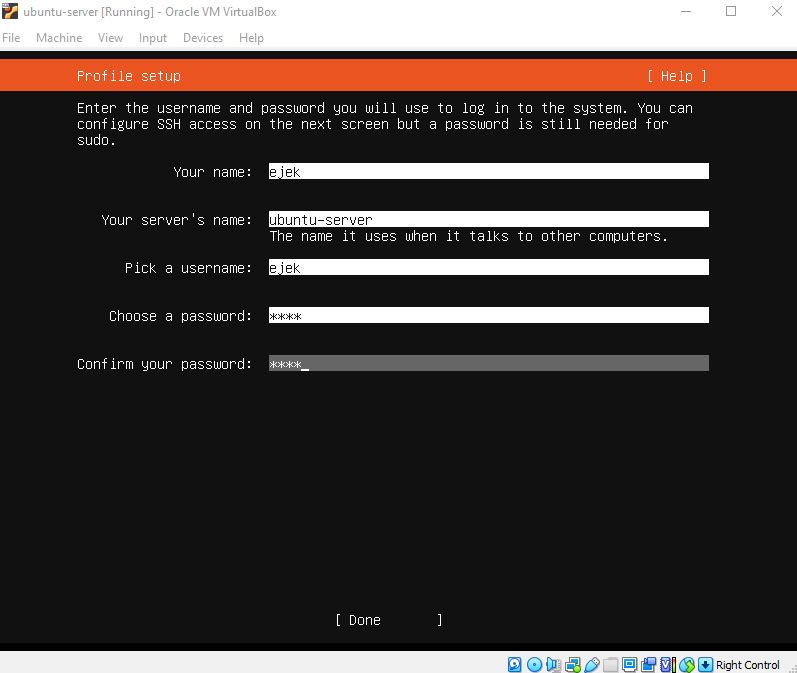

Document follows [this guide](https://www.free5gc.org/installations/stage-3-vm-basics/) with every step listed below included.

- [Creating a Ubuntu VM using VirtualBox](https://www.free5gc.org/installations/stage-3-vm-basics/)
- [Creating and Configuring a free5GC VM](https://www.free5gc.org/installations/stage-3-free5gc-vm/)
- [Installing and Testing free5GC Core Network](https://www.free5gc.org/installations/stage-3-free5gc-install/)
- [Installing a UE/RAN Simulator](https://www.free5gc.org/installations/stage-3-sim-install/)
- [free5GC Simple Apps](https://www.free5gc.org/installations/stage-3-free5gc-app/)
- [free5GC Demo Videos](https://www.free5gc.org/stage-3-videos/video-index/)
- [Environment setup of multiple SMF, DNN, and UPF (including ULCL)](https://www.youtube.com/watch?v=AEMrjKRWarw)

# Step 1 - Create Ubuntu Server VM

## 1 Install Virtual Box

## 2 Download Ubuntu Server

Use this link


## 3 Create a Ubuntu Server VM

> We use Ubuntu Server instead of Ubuntu Desktop because we only need a basic server machine without too many unnecessary functionalities. The resulting overhead to your host machine is smaller, and the VM starts up faster too.

### 3.1 New VM

Launch VirtualBox and click `new`.


- Name the first VM using a generic name as `ubuntu`, `ubuntu-server`, or `ubuntu-20.04`
- You can pick 1 or 2 (or more) CPUs, and about 2048M memory, although you can change them later


- Create a virtual hard disk VDI with about 10GB memory size.


### 3.2 Setup VM

- You can increase the CPU number from default 1 to 2.


- Also we need to plug in our "CD" with ubuntu (the .iso file)
- To do so move to "Storage" and clikc "+" under Controller: IDE option as shown below


- And add your .iso file and the choose it


- Move to the "Network" and enable second adapter. Make it Host-only, rest of config leave default.


### 3.3 Start the VM

Installation is a long process I will list only the key-points. Unsaid things leave default and things like language, keyboard etc. are left for you.

- Choose "Ubuntu Server" option from GRUB menu
- Choose "Ubntu Server" as the base for installation not "Ubuntu server (minimized)"
- Leave Network Connections default
  - 

- Uncheck "the LVM option"
  - not choosing LVM will make it a little bit easier later if you want to extend your disk space


- it is recommended that you choose short username and password for ease of typing later



- Install SSH server


- Later follow the displayed instructions.

### 3.4 Test your ubuntu-server installation

After you've logged in type in some commands:

- `ping google.com`
- `ifconfig`
  - It may require installation of `net-tools`


Of course addresses on your machine may differ.

Your display may look different, but take notes about the IP address of the *Host-only* interface card. The example above shows `192.168.56.101`. You can SSH from your host machine into this Ubuntu VM using the IP later. (Another IP address, `10.0.2.15` is the IP address of the NAT interface card, the apps in your host machine cannot access it).

## 4 Connect to the Ubuntu-server VM via SSH

### 4.1 Launch MobaXterm

On your host system (in my case - Windows) launch MobaXterm, which is my favourite SSH client. You can download it from [here](https://mobaxterm.mobatek.net).

- Open new terminal tab


- Paste this command into the terminal

```bash
  ssh <host_only_network_IP_adrress_of_ubuntu_server> -l <username_on_ubuntu_server>
```

- In my case it is:

```bash
ssh 192.168.56.101 -l ejek
```

### 4.2 Test SSH connection

Check if you can perfom following actions:

- `ping google.com`
- `ifconfig`


From now on the communication with ubuntu-server can be done by SSH connection. 

## 5 Update and Upgrade your Ubuntu

Let also update and upgrade the Ubuntu VM right now to make sure it is up-to-date with proper security updates.

```bash
sudo apt update
sudo apt upgrade
```

## 6 How to exit the configuration

- In SSH Client you can type `exit`to close the connection.


- You can close the SSH Client now.

- On the Ubuntu-server VM just click the "X" to close the window. When the dialog pops-up select "Send the shutdown signal"


You can close the Virtual Box window.

## 7 How to run it the next time

1. Launch Oracle VM VirtualBox Manager
2. Select "ubuntu-server" VM and start it.
3. Launch SSH Client (e.g. MobaXterm)
4. Type in   `ssh <host_only_network_IP_adrress_of_ubuntu_server> -l <username_on_ubuntu_server>`
   1. e.g `ssh 192.168.56.101 -l ejek`

# Step 2 - Clone VM and setup network

## 1 Check up an existing VM for Cloning

Launch VirtualBox, and make sure the Ubuntu VM (ubuntu) we created before can boot up, then:

- Log in into the VM using SSH from the host machine, and check if the VM has internet access
  - `ssh 192.168.56.101 -l ejek`
  - `ping google.com`

- Make sure you have done `sudo apt update` and `sudo apt upgrade` (or you can do it again)
- Shutdown the VM
  - `sudo shutdown -P now`

VM is ready to clone!

## 2 Clone the VM

- From the virtual box select ubuntu-server VM, and from "snapshots" options select "clone".


- Name it "free5gc" and select correct MAC Address Policy

  

- In the next window its your choice, both (linked and full) options will do.

- After the new VM is created
  - Start up the new free5gc VM, and use the same username and password to log in
  - In the Ubuntu terminal run `ping google.com` to make sure it has internet access, and `ifconfig` to note IP address of the Host-only network interface
    - for example the IP could still be `192.168.56.101`, and interface name is `enp0s8`
  - Log in into free5gc VM using SSH, and run the same commands again, to check it SSH work properly

## 3 Change hostname

VM still has host name that you gave to the original one (or ubuntu if you left it default). Let's rename it to `free5gc`.

```bash
sudo nano /etc/hostname 
```

In the file, change `<previous_name>` into `free5gc`。If you are using `nano` ，you can press Ctrl-O to save the file, then Ctrl-X to exit.

Check if changes are saved.

```bash
cat /etc/hostname
```

Let's also change the file `/etc/hosts/` by replacing  `<previous_name>` with `free5gc`.

```bash
sudo nano /etc/hosts
```

Content of `/etc/hosts/` should look like this:


The changes will take effect after next reboot.

```bash
sudo shutdown -r now
```

## 4 Setting Static IP Address

The Host-only network interface, by default, gets its IP address through DHCP. The cloned free5gc VM seems to have trouble obtaining new IP address. We can change the host-only interface to use static IP address instead, which can save a lot of trouble later. So we will fix the static IP address as `192.168.56.101`.

```bash
cd /etc/netplan
ls
```

The only file that will be shown is `00-installer-config.yaml`

Let's display its content:


It means the VM has two interfaces:

- enp0s3
- enp0s8
  - which we know is the Host-only network Interface

To fix a static IP to the interface, we need to disable dhcp protocol and add `addresses` attribute with value `[<ip_address_1>, <ip_address_2>, ...]`

Use nano:

```bash
sudo nano 00-installer-config.yaml
```

and change it to:

```yaml
# This is the network config written by 'subiquity'
network:
  ethernets:
    enp0s3:
      dhcp4: true
    enp0s8:
      dhcp4: no
      addresses: [192.168.56.101/24]
  version: 2
```

Verify:


Now check if the new configuration is correct syntax:

```bash
sudo netplan try
```


Press Enter to exit and apply the new interface settings

```bash
sudo netplan apply
```

Run `ifconfig` to see if the network setting has been changed correctly:

We can also check the routing table, just to have a grasp of what is going on regarding the network setting:

```bash
route -n
```


As we remember the VM has to adapters which we can check in VirtualBox under VM network settings.


- Now the NAT network adapter enp0s3 has IP `10.0.2.2` and it belongs to NAT network `10.0.2.0/24`.

- The host-only adapter enp0s8 has IP `192.168.56.0`

From the display above, we learn that the Host-only network `192.168.56.0/24` does not have internet access by itself (even though we can access it using SSH from the host machine). Internet access is through the NAT network `10.0.2.0/24`, with the gateway being `10.0.2.2` (provided by VirtualBox).

## Step 3 How to run it the next time

1. Launch Oracle VM VirtualBox Manager

2. Select "free5gc" VM and start it.

3. Launch SSH Client (e.g. MobaXterm)

4. Type in:

   ```bash
   ssh 192.168.56.101 -l ejek
   ```
This is  how we interact with free5gc VM from now on.

