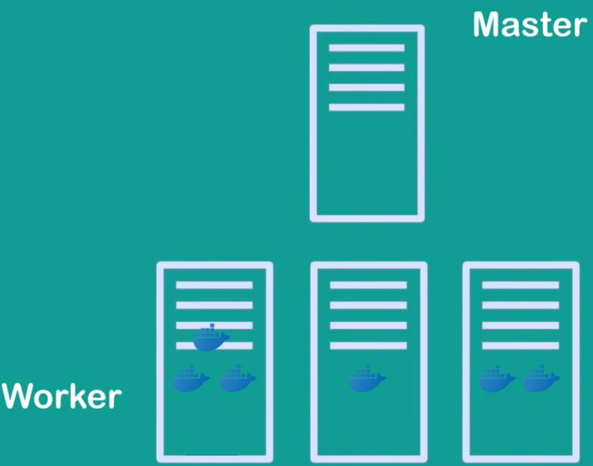

# Introduction to clusters

There are a few other terms that you need to understand before defining a cluster.

## 1 Container

There was problem in Software development that The developer build the code and send it to tester or client, but then the code wouldn't work on their system. It was caused by the difference in computer environments. Software may require some dependencies with specific version or some system specific settings. On different PC this can very vary.

 So what can be solution to this?

The solution is  same computer environments for developer, tester and client. This is where the Virtual Machine entered the scene of software development. The developer can set properly OS on the VM and then share it to tester or client.

Problems with Virtual Machine was:

- Occupies a lot of memory space
- Long boot-up time
- Unstable performance with multiple VMs
- Difficult to scale up (e.g. increase VM resources like RAM, or CPU, because it requires the reboot)
- Compatibility issues while porting between different platforms
- Data volumes (disk memory) cannot be shared between VMs
- VM requires reboot when porting between different infrastructures.

To solve this problems **Containers** where invented.

In terms of software development a **Container** is a unit of software that packages up code and all of its dependencies so the application run quickly and reliably from one computing environment to another. 

A **Container image** is a lightweight, standalone, executable package of software that includes everything needed to run an application:

- code
- runtime
- system tools
- system libraries
- settings

Container images become containers at runtime.

### 1.1 Implementation

**Container** is a sandboxed* process on your machine that is isolated from all other processes on the host machine. That isolation leverages *kernel namespaces and cgroups*, features that have been in Linux for a long time. Containers are isolated from each other and run their own software, binaries, and configurations. Container is a running instance of an image.

While running a container, it uses an isolated filesystem. This custrom filesystem is provided by a **container image**.  Since the image contains the container’s filesystem, it must contain everything needed to run an application - all dependencies, configuration, scripts, binaries, etc. The image also contains other configuration for the container, such as environment variables, a default command to run, and other metadata.

*In computer security, a sandbox is a security mechanism for separating running programs

### 1.2 Docker

Docker is a container engine.

## 2 Kubernetes

Kubernetes is a container orchestration tool for automating software development, scaling and management.

Kubernetes can manage docker containers. It helps you manage application which are made of multiple containers and it also helps you to manage these apps in different deployment environments (VMs, Physical machines, Cloud)

### 2.1 What problem does Kubernetes solve?

Trend of Software Design from Monolith architecture to Microservices.

Now applications are build from thousand of microservices working together.

Containers are perfect host for small, independent applications (called microservices). Each microservice of an application resides in his own container and all of these containers make up one application.

Managing all containers across multiple environments* using scripts or self-made tools can be really tough or even impossible, that why we need a container orchestration tool.

*One microservice can be in a cloud, and the second on VM in data center across the country.

### 2.2 What does Kubernetes offer?

- Hight availability
  - Application has no downtime, its always accessible by the users.
- Scalability
- Disaster recovery
  - If infrastructure has some problem like data is lost or server explodes. The kubernetes has some mechanisms to backup the data. And it can run from the latest state after the recovery.

### 2.3 Kubernetes Cluster

A one application (made with lots of microservices on containers) that is orchestrated by Kubernetes in called **Kubernetes Cluster**.

A Kubernetes cluster consists of a set of worker machines (PC, VM, Cloud server etc.) called **nodes**, that run containerized application. 

#### Basic Architecture

The actual application is running on **Worker nodes**, the **Master node** runs several Kubernetes processes that are necessary to run and manage cluster.

##### **Worker node**

Node components are:

- kubelet
- kube-proxy
- Container runtime

They run on every worker node, maintaning running **pods** and providing the Kubernetes runtime environment.

**kubelet**

An agent that makes sure that containers are running in a Pod.

**kube-proxy**

A network proxy that implements part of the *Kubernetes Service*

> **Kubernetes Service** - a way to expose an application running on a pod (or set of pods) as a network service

**Container runtime**

Software responsible for running containers

> Kubernetes supports several container runtimes: 
>
> - Docker 
>
> - containerd
> - CRI-O
> - any implementation of the Kubernetes CRI (Container Runtime Interface)

##### Master node

Master node is the node for control plane of the cluster. Its components are:

- api
- c-m (Controller Manager)
- sched (Scheduler)

**api**

It is an entry-point to the Kubernetes Cluster. The process (which is hosted in a Container btw.) that any clients will talk to.

Clients such as:

- UI
  -  if u are using Kubernetes Dashboard
- API 
  - if u are using some scripts 
- CLI
  - Command Line Interface

**c-m**

Keeps track of what's happening in the cluster.

Whether smth needs to be repaired, or maybe if container died and it needs to be restarted etc.

**sched**

Responsible for scheduling containers on different nodes based on workloads and available resources on nodes. 

Intelligent process that decides on which worker node the next container should be scheduled on.

**etcd**

Key value storage.

Holds the current state of the Kubernetes Cluster. All config and status data of each node and container inside nodes. 

Clusters are recovered from etcd-snapshots. It Kubernetes backing store.

##### **Virtual Network**

Component that makes possible to nodes talk to each other. It spans the cluster.

### 2.4 Kubernetes Basic Contepts

 #### 2.4.1 Pod

> The smallest unit, that you will configure and interact with as a Kubernetes user. It's basically a wrapper for a container.

> Usually you will have one Pod per microservice:
>
> - database => one pod
> - message broker => next pod
> - HTTP server => next pod

**Pod** - represents a set of containers.

>  In K8S* you only work with the Pods, which is an abstraction layer over the containers.

*Kubernetes  is also know as "K8S". "ubernete" is replaced with "8", because `"ubernete".length=8`

#### 2.4.2 Service

Every Pod has its own IP which Virtual Network uses.

If container inside a pod dies, Pod restarts it. But Pod can also die very frequently. But when a Pod dies, a new Pod is created, and a new IP address is assigned.

> For example, if you HTTP server Pod talks to a database Pod with IP address, when DB Pod restarts the old IP address is deprecated.

A this is where the **Service** definition comes up.

A Service is basically a substitute to this IP addresses. 

Instead of IP addresses which dynamically change, there are Services sitting in front of each Pod, that talk to each other.

> Now if the Pod behind the service dies and gets recreated the services stays alive, because their lifecycles are not tight to each other.

Service has two functions:

- permanent IP address
- load balancer

#### 2.4.5 Node

Kubernetes runs your workload by placing containers into Pods to run on ***Nodes***. A node may be a virtual or physical machine, depending on the cluster. Each node is managed by the control plane and contains the services necessary to run Pods.

#### 2.4.6 Control Plane

**Control Plane** - is the container orchestration layer that exposes the API and interfaces to define, deploy, and manage the lifecycle of containers.

It manages the worker nodes and the Pods in them.

The Control Plane components make global decisions about the cluster (for example - scheduling), as well as detecting and responding to cluster events (for example, starting up a new pod when a deployment's `replicas` filed is unsatisfied). 

#### 2.4.7 kube-apiserver

The API server is a component of the Kubernetes control plane that exposes the Kubernetes API. This is the fronted of the control plane.

It is an entry-point to the Kubernetes Cluster. The process that: 

- UI (Kubernetes Dashboard) ,
- API clients (scripts),
- CLI 

can talk to.

Also this is the way Control Plane talks to the worker nodes.

#### 2.4.8 etcd

A component of the Kubernetes control plane.

Consistent and highly-available key value storage used as Kubernetes' backing store for all cluster data.

Clusters are recovered from etcd-snapshots. 

#### 2.4.9 kube-scheduler

Control plane component that watches for newly created [Pods](https://kubernetes.io/docs/concepts/workloads/pods/) with no assigned [node](https://kubernetes.io/docs/concepts/architecture/nodes/), and selects a node for them to run on.

Factors taken into account for scheduling decisions include: individual and collective resource requirements, hardware/software/policy constraints, affinity and anti-affinity specifications, data locality, inter-workload interference, and deadlines.

#### 2.4.10 kube-controller-manager

Controller plan component that runs **Controller** processes.

**Controller** - a loop that watches the shared state of the cluster through the *kube-apiserver* and make changes towards moving from current state towards desired state.

Some types of controllers are:

- Node controller - Responsible for noti cing and responding when nodes go down.
- Job controller: Watches for Job objects that represent one-off tasks, then creates Pods to run those tasks to completion.
- Endpoints controller: Populates the Endpoints object (that is, joins Services & Pods).
- Service Account & Token controllers: Create default accounts and API access tokens for new namespaces.

#### 2.4.11 kubelet

An agent that runs on each *worker node* in the cluster. It makes sure that containers are running in a Pod.

The kubelet takes a set of PodSpecs that are provided through various mechanisms and ensures that the containers described in those PodSpecs are running and healthy. The kubelet doesn't manage containers which were not created by Kubernetes

#### 2.4.12 kube-proxy

kube-proxy is a network proxy that runs on each worker node in your cluster, implementing part of the Kubernetes *Service* concept.

kube-proxy maintains network rules on nodes. These network rules allow network communication to your Pods from network sessions inside or outside of your cluster.

kube-proxy uses the operating system packet filtering layer if there is one and it's available. Otherwise, kube-proxy forwards the traffic itself.

## 3 Helm

### 3.1 What is Helm?

**Package manager for Kubernetes.**

- like `apt` or `yum` for Kubernetes
- convenient way of packaging collections of Kubernetes YAML files and distributing them in public and private repositories.

Bundle of YAML files is called **Helm Chart**

Common used application like Database App (MongoDB, MYSQL) or Monitoring Apps like Prometheus that has this complex cluster setup with YAML files all have Helm Chart in some repository, so you can reuse that configuration.

**Templating Engine**

Let's say you have an application that is made up with multiple microservices. And you are deploying all of them in your K8S cluster. And deployment of every microservice is pretty much the same with only difference in the app name and version. 

But the most values in YAML files are the same, you can define a common blueprint with placeholders.

And you can define `Values.yaml` files to fill placeholders.

## 4 Kubectl

This is the Kubernetes command line tool, allows you to run commands againt K8S Clusters. 

You can use kubectl to deploy applications, inspect and manage cluster resources, and view logs.

## 5 Kubeadm

You can use the kubeadm tool to create and manage Kubernetes clusters. It performs the actions necessary to get a minimum viable, secure cluster up and running in a user friendly way.

The `kubeadm` tool is good if you need:

- A simple way for you to try out Kubernetes, possibly for the first time.
- A way for existing users to automate setting up a cluster and test their application.
- A building block in other ecosystem and/or installer tools with a larger scope.