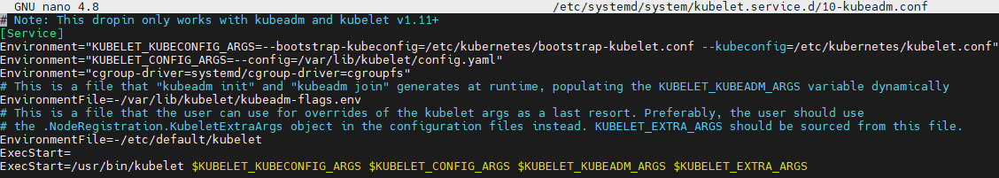

# Create Cluster

Prerequisites for deploying free5gc helm charts on K8S cluster, are following:

1. A Kubernetes cluster supporting SCTP
   -  Stream Control Transmission Protocol -  message-oriented transfer protocol. All of the newest version of Kubernetes support it, so don't worry.

2. Kubernetes worker nodes with `kernel 5.0.0-23-generic` and containing `gtp5g kernel module` 

   - It is required for `Free5GC UPF element`

   - These steps are familiar for you if you've done On_VMs installation

3. Multus-CNI installed on each *node* 

   - It is a K8S plugin

   - Multus-CNI is a container network interface (CNI) plugin for Kubernetes that enables attaching multiple network interfaces to pods. Typically, in Kubernetes each pod only has one network interface (apart from a loopback) -- with Multus you can create a multi-homed pod that has multiple interfaces.

4. A Persistent Volume (size 8Gi).

5. A physical network interface on each Kubernetes node named eth0.

6. A physical network interface on each Kubernetes node named eth1 to connect the UPF to the Data Network.

These are the prerequisites for installing free5gc helm charts and will be referred as `prerequisite 1.`, `prerequisite 2.` and so on...

## 1 Create pure cluster

### 1.1 What will be created?


### 1.2 Installation steps

Installation steps vary on the node type, but there are some common steps:

1. Set Static IP
2. Update Hostname, Hosts
3. Update Apt Repository
4. Turn off Swap Space
5. Install Docker and OpenSSH
6. Install Kubernetes tools

After this steps on the Master node:

1. Initiate Kubernetes Cluster
2. Install the Pod Network
3. Setup the Kubernetes Dashboard

And then on every Worker node you need to:

- Join the Cluster

### 1.3 Create VMs

But the first thing to do is to create Virtual Machines to host the cluster.

We will use the Ubuntu-server machine template and clone it 3 times.

Cloning was described under the [2 Clone the VM chapter](../on_VMs/Create 5G Core VM.md#2 Clone the VM)

After cloning and running machines in my Virtual Box I can see:


Now run all of the machines and note IP addresses.

```sh
ifconfig
```

They are all the same, so we need to set static IP addresses for each machine here.

### 1.4 Set Static IP addresses

Run:

```sh
cd /etc/netplan
sudo nano 00-installer-config.yaml
```

Change the file to:

```sh
# This is the network config written by 'subiquity'
network:
  ethernets:
    enp0s3:
      dhcp4: true
    enp0s8:
      dhcp4: no
      addresses: [<ip_address>/24]
  version: 2
```

You can verify if changes were saved:

```sh
cat 00-installer-config.yaml
```

Now, check the configuration

```sh
sudo netplan try
```

If You can Accept the last step is to apply the netplan.

```sh
sudo netplan apply
```

Repeat these steps for every VM.

Addresses I set for my VMs are:

- `192.168.56.110` - for `master`
- `192.168.56.111` - for `worker1`
- `192.168.56.112` - for `worker2`

Reboot the machines and assure the IP addresses are assigned correctly.

```sh
ifconfig
```

From now you can use SSH client (e.g. MobaXterm)

```sh
ssh <ip_address_of_VM> -l <username>
```

Check connectivity between your VMs using `ping`

e.g. 

```sh
ping 192.168.56.111 //from master and worker2 to worker1 
```

### 1.5 Update hostname and hosts

On every machine run:

```sh
sudo nano /etc/hostname
```

And change `ubuntu-server` to proper name

```sh
sudo nano /etc/hosts
```

And change `ubuntu-server` to proper name

```sh
sudo reboot
```

After a while you will be able to reconnect to the machine.

I named my machines:

- `K8S-master`

- `K8S-worker1`

- `K8S-worker2`

### 1.6 Update Apt Repository

Run on all machines

```sh
sudo apt-get update
```

```sh
sudo apt-get upgrade
```

### 1.7 Turn off Swap Space

> **What is Swap Space?**
>
> It is a technique used to expand RAM resources.
>
> Swap space is a physical memory page placed at the top of a disk partition or a special disk file.
>
> When Linux runs out of RAM the inactive RAM pages (processes that are not on the top of stack), are moved to the swap space.
>
> **Why to turn off Swap Space?**
>
> The Kubernetes scheduler determines the best available node on which to deploy newly created pods. If memory swapping is allowed to occur on a host system, this can lead to performance and stability issues within Kubernetes. For this reason, **Kubernetes requires that you disable swap in the host system**

In order to turn off swap space you need to run command:

```sh
sudo swapoff -a
```

And then comment out Swap File entry in `/etc/fstab` file

```sh
sudo nano /etc/fstab
```

Like this:


### 1.8 Install Docker and OpenSSH

We are using Ubuntu-Server to OpenSSH should be already installed. Check it:

```sh
ssh -V
```

If your output is as following, everything is all right


If not just use:

```sh
sudo apt-get install openssh-server
```

To install Docker run:

```sh
apt-get install -y docker.io
```

### 1.9 Install Kubernetes tools

Requirements for installing `kubeadm`:

- Unique hostname, MAC address and product_uuid for every node
- Disabled Swap
- Connectivity between nodes
- Certain ports opened

Majority of these requirements we've met in Previous Steps. We are only left with:

- Check if MAC addresses on `enp0s8` differ
  - Use `ip link` on each machine
- Check if `product_uuid` differ
  - Use `sudo cat /sys/class/dmi/id/product_uuid`


Run this commands:

```sh
sudo apt-get update
sudo apt-get install -y apt-transport-https ca-certificates curl
```

```sh
sudo curl -fsSLo /usr/share/keyrings/kubernetes-archive-keyring.gpg https://packages.cloud.google.com/apt/doc/apt-key.gpg
```

```sh
echo "deb [signed-by=/usr/share/keyrings/kubernetes-archive-keyring.gpg] https://apt.kubernetes.io/ kubernetes-xenial main" | sudo tee /etc/apt/sources.list.d/kubernetes.list
```
Not that this is one line command!
```sh
sudo apt-get update
sudo apt-get install -y kubelet kubeadm kubectl
sudo apt-mark hold kubelet kubeadm kubectl
```

### 1.10 Prepare Kubernetes configuration

Run on each node

```sh
sudo nano /etc/systemd/system/kubelet.service.d/10-kubeadm.conf
```

And paste this line:

```sh
Environment="cgroup-driver=systemd/cgroup-driver=cgroupfs"
```

As last `Environment` line.



Update `/etc/hosts` file

Every node should have this 3 entries:

```sh
192.168.56.110 K8S-master
192.168.56.111 K8S-worker1
192.168.56.112 K8S-worker2
```

Like this:


Now `sudo rebbot` and reconnect to all of the machines.

This is the last step performed on every node.

 ### 1.11 Initiate Kubernetes Cluster

```sh
sudo kubeadm init --pod-network-cidr=<pod_network_address_range> --apiserver-advertise-address=<ip_address_of_master_node>
```

In my case it will be

```sh
sudo kubeadm init --pod-network-cidr=192.168.0.0/16 --apiserver-advertise-address=192.168.56.110
```

It may take some time depending on your Internet connection

Here is the place when everything fucks up.
