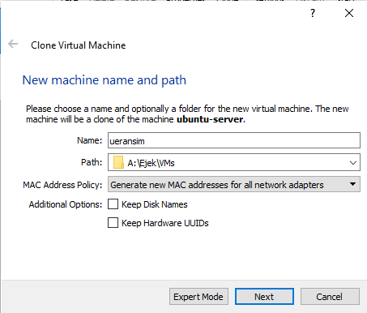
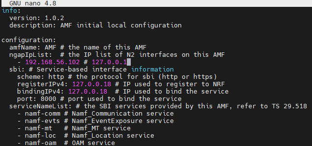
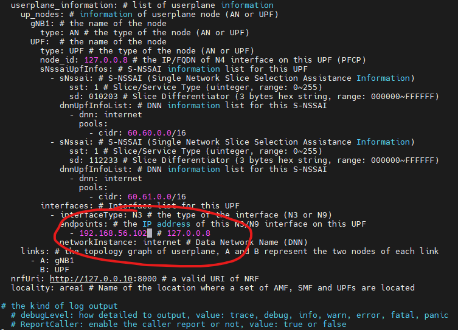
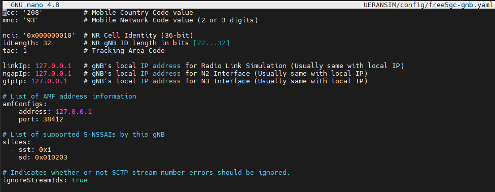
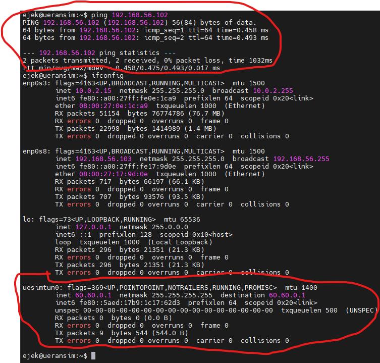
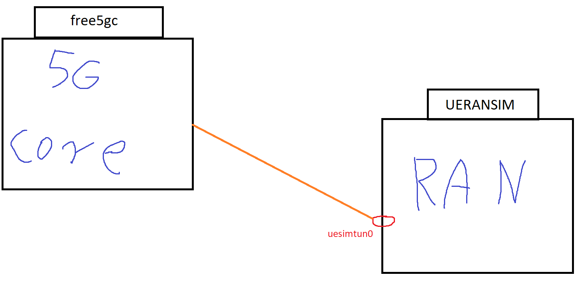

# Create UERANSIM VM

UE/RAN Simulator is a simulator of User Equipment/Radio Access Network.

# Step 1 -  Setup VM

## 1.1 Clone ubuntu-server machine

Activities in this step are similar to the ones done in [Create 5G Core VM](#Create 5G Core VM).




- In the next step both "full clone" or "linked clone" option will work.

## 1.2 Set static IP address

Run `ifconfig` to note IP address of  Host-Only Network Interface

```
ifconfig
```

In my case it was again `192.168.56.102`, so first thing I did was to set a static IP address to `192.168.56.103`. We assigned `192.168.56.102` as a static IP address to free5gc VM. Two machines can't have the same address, so we need to change it.

> Probably while free5gc VM is not running DHCP on my local network takes 102 as first available address.

```bash
cd /etc/netplan
cat 00-installer.yaml
```

Change the file to:

```yaml
# This is the network config written by 'subiquity'
network:
  ethernets:
    enp0s3:
      dhcp4: true
    enp0s8:
      dhcp4: no
      addresses: [192.168.56.103/24]
  version: 2
```

```bash
sudo netplan try
```

Press Enter

```bas
sudo netplan apply
```

Run `ifconfig` to check if network setting has been changed correctly.

```bash
ifconfig
```

## 1.3 Setup  SSH Connection

- Run your favorite SSH Client (Mine is MobaXterm).
- Open new terminal and type

```bash
ssh 192.168.56.103 -l ejek
```

## 1.4 Change hostname

Run

```bash
sudo nano /etc/hostname
```

Change `ubuntu-server` to `ueransim` (or the same name you gave the ueransim VM).

Click`ctrl+o` + `enter` + `ctrl+x` to exit nano.

Run to see if changes saved.

```bash
cat /etc/hostname
```

Now open `/etc/hosts`

```bash
sudo nano /etc/hosts
```

Check the file content

```bash
cat /etc/hosts
```

It should look like this 

## 1.5 Reboot the machine

```bash
sudo shutdown -r now
```

In the meantime run the free5gc VM.

Log in to the machines and run `ifconfig` on both of them, to check IP addresses configuration.

In my case it is:


## 1.6 Ping VMs

Log in to the machines via SSH (it may require opening a new terminal card).

Ping both machines from each other.

```bash
ping <address_of_second_VM>
```

If both machines can ping each other everything is ok. You can move on.

# Step 2 - UERANSIM installation

## 2.1 Visit Github

Visit [this page](https://github.com/aligungr/UERANSIM/wiki/Installation) and follow instructions. 

Below (from 2.2) is the documentation of installation state that I found. It may differ in your case.

## 2.2 Clone repository

Go to `$HOME` directory and clone repository.

```bash
cd $HOME
git clone https://github.com/aligungr/UERANSIM
```

## 2.3 Install dependencies

>  It is a good practice as a Linux User to update your apt repositories and upgrade packages before every installation.

```bash
sudo apt update
sudo apt upgrade
```

Run a few `apt install`'s

```
sudo apt install make
sudo apt install gcc
sudo apt install g++
sudo apt install libsctp-dev lksctp-tools
sudo apt install iproute2
sudo snap install cmake --classic
```

## 2.4 Build UERANSIM

```bash
cd ~/UERANSIM
make
```

# Step 3 - Use WebConsole to Add an UE

## 3.1 Run WebConsole server

Switch to free5gc SSH session and run

```bash
cd ~/free5gc/webconsole
go run server.go
```

## 3.2 Open Web Browser

Open your web browser from your host machine, and enter the URL `http://<free5gc_VM_ip>:5000`

iny my case:

```url
http://192.168.56.102:5000/#/
```

## 3.3 Add an UE

- On the login page, enter username `admin` and password `free5gc`
- Once logged in, widen the page until you see “Subscribers” on the left-hand side column.
- Choose "Subscribers"and create a new data:
  - Note that other than the “Operator Code Type” field which you should choose “OP” for now, leave other fields unchanged. This registration data is used for ease of testing and actual use later.
- After the data is created successfully, you can press Ctrl-C on the terminal to quit WebConsole


- After you submitted you can stop the server using `ctrl+c` and `clear` command to clear the screen.

## Step 4 Setting free5gc and UERANSIM params

In free5gc VM, we need to edit three files:

- `~/free5gc/config/amfcfg.yaml` - Config of ***Access and Mobility Management Function***
- `~/free5gc/config/smfcfg.yaml` - Config of ***Session Management Function***
- `~/free5gc/NFs/upf/build/config/upfcfg.yaml` - Config of ***User Plan Function***

## 4.1 AMF

First SSH into free5gc VM, and change `~/free5gc/config/amfcfg.yaml`

```bash
cd ~/free5gc
nano config/amfcfg.yaml
```

Replace ngapIpList IP from `127.0.0.1` to `<free5gc_VM_ip>`  (`192.168.56.102` in my case), namely from:

```bash
...
  ngapIpList:  # the IP list of N2 interfaces on this AMF
  - 127.0.0.1
...
```

into

```bash
...
  ngapIpList:  # the IP list of N2 interfaces on this AMF
...
```



## 4.2 SMF

Edit `~/free5gc/config/smfcfg.yaml`

```bash
nano config/smfcfg.yaml
```

and in the entry inside userplane_information / up_nodes / UPF / interfaces / endpoints, change the IP from `127.0.0.8` to `192.168.56.102`, namely from

```bash
...

  interfaces: # Interface list for this UPF
   - interfaceType: N3 # the type of the interface (N3 or N9)
     endpoints: # the IP address of this N3/N9 interface on this UPF
       - 127.0.0.8
```

into

```bash
...
  interfaces: # Interface list for this UPF
   - interfaceType: N3 # the type of the interface (N3 or N9)
     endpoints: # the IP address of this N3/N9 interface on this UPF
       - 192.168.56.102  # 127.0.0.8
```



## 4.3 UPF

Finally, edit `~/free5gc/NFs/upf/build/config/upfcfg.yaml`

```bash
cd $HOME
nano free5gc/NFs/upf/build/config/upfcfg.yaml
```


and change gtpu IP from `127.0.0.8` into `192.168.56.102`, namely from

```bash
...
  gtpu:
  - addr: 127.0.0.8
```

into

```bash
...
  gtpu:
  - addr: 192.168.56.101  # 127.0.0.8
```


# Step 4 -  Setting UERANSIM

In the ueransim VM, there are two files related to free5GC：

- `~/UERANSIM/config/free5gc-gnb.yaml`
- `~/UERANSIM/config/free5gc-ue.yaml`

The second file is for UE, which we don’t have to change if the data inside is consistent with the (default) registration data we set using WebConsole previously.

## 4.1

First SSH into ueransim, and edit the file `~/UERANSIM/config/free5gc-gnb.yaml`

```bash
cd $HOME
nano UERANSIM/config/free5gc-gnb.yaml
```

Change:

-  `ngapIp IP` from `127.0.0.1` to `192.168.56.103`，

-  `gtpIp IP`, from `127.0.0.1` to `192.168.56.103`,
- change the IP in `amfConfig` into `192.168.56.102`

From:



To:


## 4.2 Examine UE file

Next we examine the file `~/UERANSIM/config/free5gc-ue.yaml`，and see if the settings is consistent with those in free5GC (via WebConsole), for example:

```bash
cd $HOME
nano UERANSIM/config/free5gc-ue.yaml
```


```
# IMSI number of the UE. IMSI = [MCC|MNC|MSISDN] (In total 15 or 16 digits)
supi: 'imsi-208930000000003'
# Mobile Country Code value
# Mobile Network Code value (2 or 3 digits)
mnc: '93'

# Permanent subscription key
key: '8baf473f2f8fd09487cccbd7097c6862'
# Operator code (OP or OPC) of the UE
op: '8e27b6af0e692e750f32667a3b14605d'
# This value specifies the OP type and it can be either 'OP' or 'OPC'
opType: 'OP'

...

# Initial PDU sessions to be established
sessions:
  - type: 'IPv4'
    apn: 'internet'
    slice:
      sst: 0x01
      sd: 0x010203

# List of requested S-NSSAIs by this UE
slices:
  - sst: 0x01
    sd: 0x010203

...
```

# Step 5 Testing UERANSIM against free5gc

## 5.1 Run 5G Core

SSH into free5gc. If you have rebooted free5gc, remember to do:

```bash
sudo sysctl -w net.ipv4.ip_forward=1
sudo iptables -t nat -A POSTROUTING -o enp0s3 -j MASQUERADE
sudo systemctl stop ufw
```

In addition, execute the following command:

```bash
sudo iptables -I FORWARD 1 -j ACCEPT
```

Also, make sure you have make proper changes to the free5GC configuration files, then run `./run.sh`

```bash
cd ~/free5gc
./run.sh
```

At this time free5GC has been started.

## 5.2 Prepare Configuration

Prepare three additional SSH terminals from your host machine

### 5.2.1 Terminal 1

In terminal 1: SSH into ueransim, make sure UERANSIM is built, and configuration files have been changed correctly, then execute `nr-gnb`

```bash
cd ~/UERANSIM
make #to make sure its build
build/nr-gnb -c config/free5gc-gnb.yaml
```

### 5.2.2 Terminal 2

In terminal 2, SSH into ueransim, and execute `nr-gnb` with admin right:

```bash
cd ~/UERANSIM
sudo build/nr-ue -c config/free5gc-ue.yaml
```

### 5.2.3 Terminal 3

In terminal 3, SSH into ueransim, and `ping 192.168.56.102` to see free5gc is alive. Then, use `ifconfig` to see if the tunnel `uesimtun0` has been created (by nr-ue):

```bash
ping 192.168.56.102
ifconfig
```



## 5.3 Test with ping

Now use `ping`:

```bash
ping -I uesimtun0 google.com
```

If `ping` gets replies, then free5GC is running properly. Congratulations!

> ping -I option
>
> **-I \*interface address\***
>
> Set source address to specified interface address. Argument may be numeric IP address or name of device. When pinging IPv6 link-local address this option is required.

What have we build is something like this:



